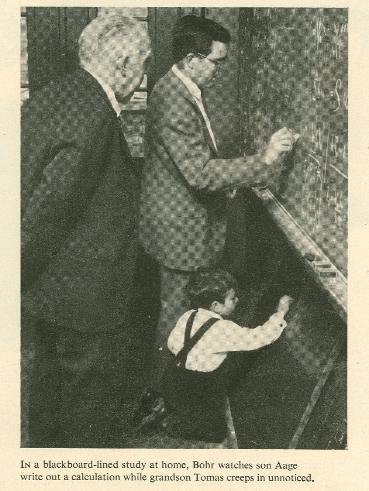

</section><section id="introducción" class="titleslide slide level1" data-background="inf.gif"> 
<h1>Introducción</h1>

# Física 

## Mapa

<a href="http://dominicwalliman.com"> Mapa y videos: Dominic Walliman</a>

</section><section data-background="map.png" data-background-size="1024px" data-background-color="#111">

</section><section data-background="cups2.jpg" data-background-size="1024px" data-background-color="#111">
<h1>
<strong>Entrelazamiento</strong>
</h1>

<strong>E. Schrödinger 1935</strong>

		
<blockquote cite="">
&ldquo;The characteristic trait of Quantum Mechanics&rdquo;
</blockquote>
		

Correlaciones sin análogo clásico en sistemas compuestos
 

## ¿Qué es una Computadora Cuántica?
</section><section data-background-video="QM1.mp4" data-background-size="1024px" controls id="video1" data-transition="fade"> 

## Algoritmos Cuánticos

##

- Algoritmo cuántico de Deutsch-Josza (1992-1998):

 

 $f:\{1,\ldots,2^n\}\rightarrow \{0,1\}$ constante o balanceada?
 
Clásicamente:  $2^{n}/2+1$ evaluaciones

 
QC: Una sola evaluación!

 
y con solo $n$ qubits!

##

- Algoritmo cuántico de Shor (1994):
 

 Transformada de Fourier discreta de $2^n$ elementos
 
 
CC: Requiere $O(2^n)$ pasos (FFT)
 
 
QC: Requiere solo $O(n^2)$ pasos!

 
Cambio de complejidad (exponencial a polinómica)

##

				
- Algoritmo cuántico de Grover (1996):
 
 Búsqueda de un elemento en un conjunto de $N$ )
 
 CC: $O(N)$ búsquedas
 
 
 QC: $O(\sqrt{N})$  búsquedas!
 

## Entrelazamiento Cuántico como Recurso:

 
Algoritmos Cuánticos 

 
Criptografía Cuántica

Teleportación Cuántica

## ¿Qué Computadoras Cuánticas Existen?
</section><section data-background-video="QM2.mp4" data-background-size="800px" data-background-color="#000" id="este" class="slide level2">

## Generalidades

<a href="../Generalidades.svg">{height=600px}</a>

# 
