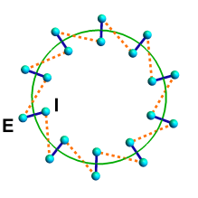
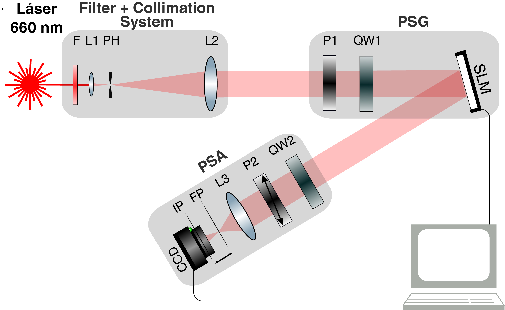
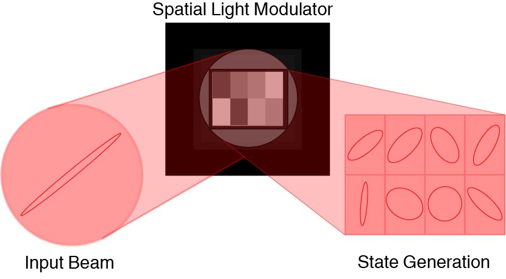

# Simulaciones Experimentales

# ¿Es Posible Vincular el Entrelazamiento Estudiado?

##

Relojes Cuánticos de Espines

{height=400px}
 

Partición adecuada $\rightarrow$ Simular Estados Historia

##

Cadena de <b>2n</b> espines:<b>n</b> &quot;externos&quot; y <b>n</b> &quot;internos&quot;
$|\Psi\rangle=\sum_{J,L}C_{JL}|J\rangle|L\rangle$

$|J\rangle$ y $|L\rangle$: estados ortonormales. 

Descomposición de Schmidt,
$|\Psi\rangle=\sum_K  \sqrt{P_K}|K_I\rangle|-K_E\rangle$

<i>DFT</i> $\Longrightarrow$ Estado Historia &quot;Externo-Interno&quot;

$|\Psi\rangle=\sum_{\tau}\frac{1}{d^{n/2}}\exp[-iH_I\tau]|I_0\rangle|\tau\rangle$

$|\tau\rangle\equiv\frac{1}{\sqrt{d^n}}\sum_K e^{-i2\pi K\tau/d^n}|K_E\rangle$  
son estados ortonormales del &quot;reloj&quot; E, con $d=2s+1$,  

$\tau=0,\ldots,d^n-1$,  

$H_I|K_I\rangle=(2\pi K/d^n)|K_I\rangle$ 

$|I_0\rangle=\sum_K\sqrt{P_K}|K_I\rangle$ es el estado inicial efectivo del sistema $I$.  

##

Los estados de Schmidt $|K_{E}\rangle$ y $|K_I\rangle$ son 
complejos entrelazados (en general).

 
Gracias a campo medio de pares, el estado de la cadena dimerizada

es simplemente $|\Psi\rangle=\otimes_{i=1}^n|\psi_i\rangle$ con $|\psi_i\rangle$ el estado del par $i$

$|\psi_i\rangle=\sum_{k}\sqrt{p_k}|k_I\rangle|-k_E\rangle$
utilizando la descomposición de Schmidt del estado del par, con $k=1,\ldots,d$ y $d=2s+1$. 

Así, la descomposición de Schmidt toma la forma 
$|\Psi\rangle=\sum_{k_1\ldots,k_n}\sqrt{p}_{k_1}\ldots\sqrt{p}_{k_n}|k_{1I}\ldots k_{nI}\rangle|-k_{1E}\ldots -k_{nE}\rangle$

Los estados de Schmidt locales son precisamente estados producto de los $n$ espines $I$ o $E$. 
Los estados $|K_E\rangle=|k_{1E}\ldots k_{nE}\rangle$, 
con $k_i=1,\ldots, 2s+1$,  $K=1,\ldots d^n$, 
forman una base producto, con $K$ expresado en notación de base $d=2s+1$ (binaria si $s=1/2$, ``ternaria'' si $s=1$, etc.).

##

Los estados locales de tiempo son la <i>DFT</i> de los $|K_E\rangle$. 

El entrelazamiento &quot;sistema-tiempo&quot; 
es n veces el entrelazamiento de un par:
 

$E(S,T)=n S(|\psi_i\rangle)$, con $S(|\psi_i\rangle)=-\sum_k p_k \log_2 p_k$ 
 

Si el estado del par es máximamente entrelazado, $p_k=1/\sqrt{2s+1}$ 
$\forall$ $k$, $\rightarrow$ $|\Psi\rangle$ es máximamente entrelazado en esta partición,
por ende cualquier base local $|K_E\rangle$ resulta en este caso equivalente. 

Una cadena de espines puede simular estados historia, 

con una dimensión que crece exponencialmente con $n$
 

# ¿Es Posible Implementarlo Experimentalmente?

## Simulación de Estados Historia por Medios Ópticos

Colaboración con el <i>Laboratorio
de Procesado de Imágenes del Departamento de Física de la Facultad de Ciencias Exactas
de la Universidad de Buenos Aires</i>
 

Se utilizan fotones individuales: 
Polarización $\rightarrow$ estado $|S_t\rangle$ del sistema cuántico $S$ 
Momento transverso $\rightarrow$ tiempo $|t\rangle$ del sistema cuántico reloj $T$.

## El Arreglo Experimental

##

{height=400px}

Se ilumina con un láser de estado sólido de 660 nm.

 
Incide en un modulador espacial de luz programable <i>SLM: Spatial Light Modulator</i>

Micro-display de <i>LCoS: Liquid Crystal-on-Silicon</i> reflectivo, con resolución 
de 1024x768 píxeles.

Permite modificar dinámicamente la función óptica píxel a píxel
 

 
Simular el estado historia $|\Psi\rangle$

En el <i>(PSA:Polarization State Analyzer)</i>  
se mide y caracteriza al <i>SLM</i>

Se realizaron medidas de intensidad en el plano imagen (IP)  
y de interferencia en el plano de Fourier (FP)

Utilizando cámaras CCD y CMOS (alta sensibilidad)

## ESQUEMA DEL SLM

{height=400px}

Se configuran ocho regiones rectangulares independientes en la pantalla

cada una con un nivel de gris constante particular.
 

Permite generar ocho estados de polarización $|S_t\rangle$

## Promedios Temporales

Se describió el arreglo experimental para simular estados historia.

- Podemos determinar el promedio temporal de valores medios del sistema, de dos formas:

 

  
Por medio de medidas secuenciales en el sistema $S$

 
Con una sola medida sobre el estado historia, que contiene toda la evolución del sistema $S$.

 
 $\frac{1}{N} \sum_{t=0}^{N-1} \langle S_t|\hat{\sigma}_\mu|S_t\rangle= \langle\Psi|(\hat{\sigma}_\mu\otimes I)|\Psi\rangle$

 
  
 
Promedios temporales de la polarización del sistema   mediante una única medida.
 

# 

